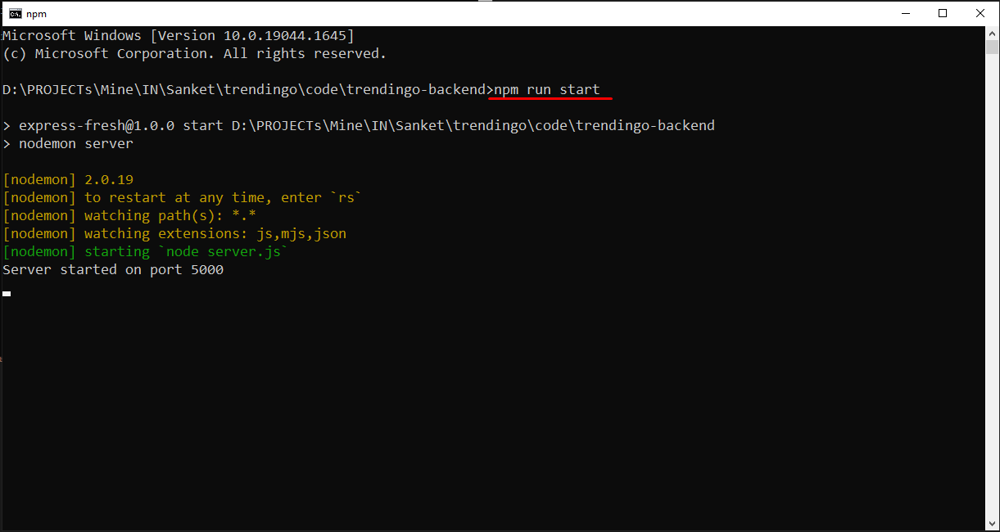

# The backend of Trendingo - Ordering service related to crypto side

## Live site

## Contact info
- **Email:** mr.new0509@gmail.com
- **Telegram:** [@mrnew0509](https://t.me/mrnew0509)
- **Skype:** [@sin085](https://join.skype.com/invite/xat3AgpiRVOI)

## Release date
TBD

## Environment
- `Node.js v14.17.0`

## Stack
- **Framework:** `Express.js v4.17.3`
- **Database:** `MySQL v8.0.27-winx64`

## How to run the project.
1. Please open terminal window in the root directory.
2. Please run command `npm run start` in it.

